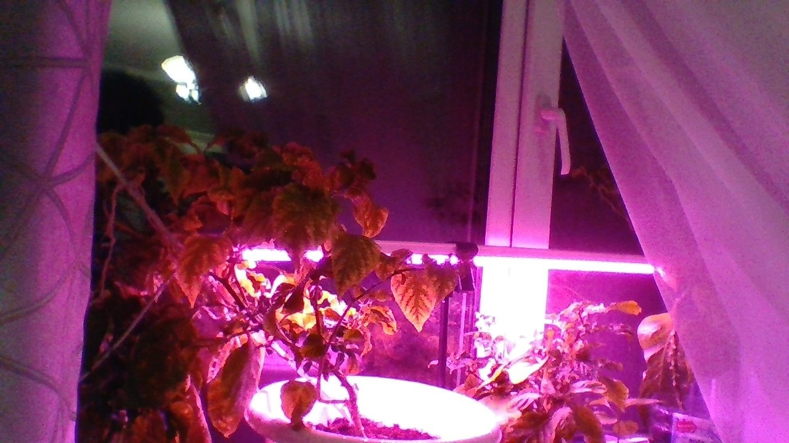
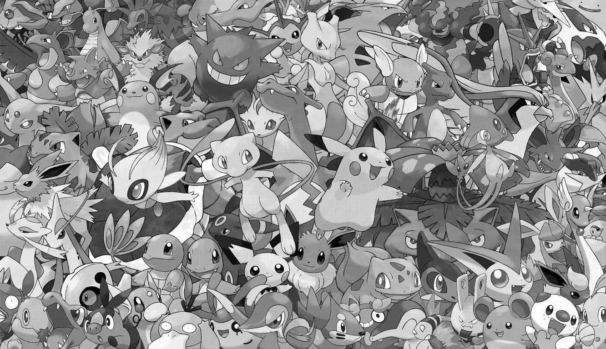
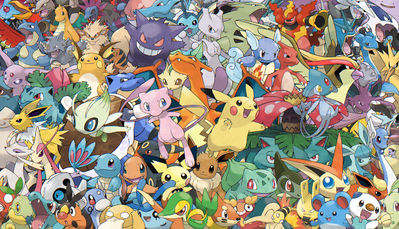
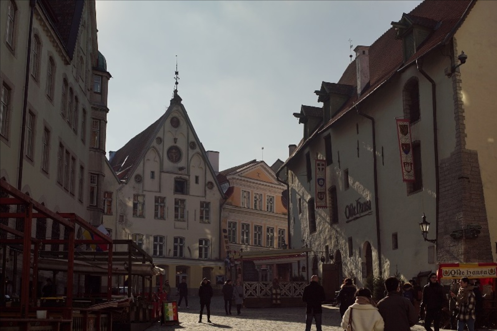
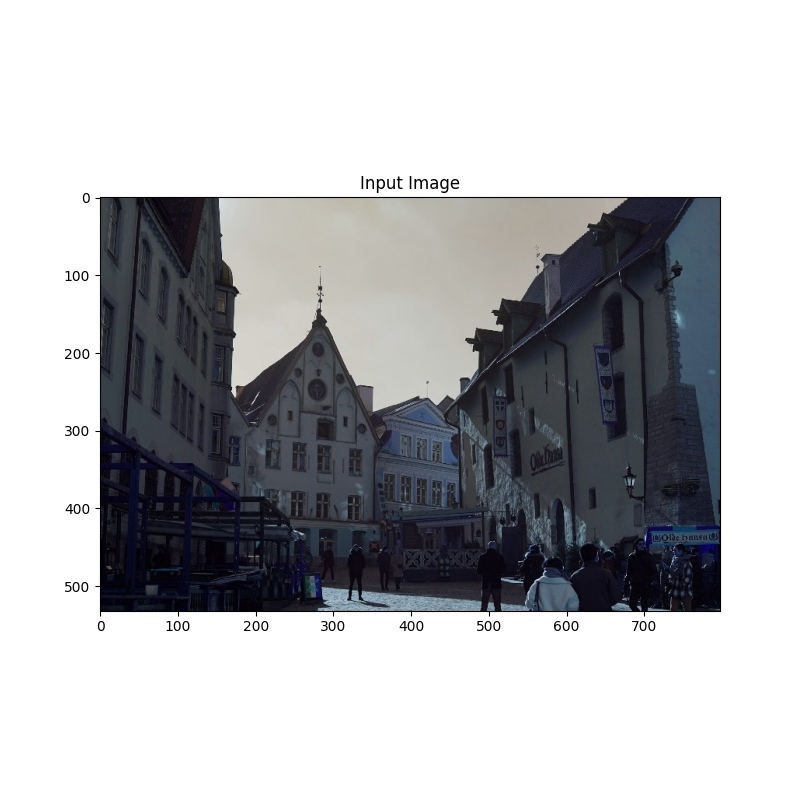

## Лабораторная работа 1. Получение изображений. Работа с RAW изображениями. Дебайеризация. Библиотеки работы с изображениями

План работ:
1. Подготовка среды программирования 
1. Поиск библиотек для работы с изображениями (OpenCV, Scikit-Image, Scipy, Python Image Library (Pillow/PIL), Matplotlib, SimpleITK, Numpy, Mahotas, Сolour)
1. Чтение изображений с камеры устройства
```
import cv2

cap = cv2.VideoCapture(0)
if not cap.isOpened():
	raise IOError("Cannot open webcam")
ret, frame = cap.read()
frame = cv2.resize(frame, None, 3, 3, cv2.INTER_AREA)
cv2.imwrite("camera.jpg", frame)
cap.release()
cv2.destroyAllWindows()

```



4. Создание алгоритма "байеризации"

```
public BufferedImage bayeriz(BufferedImage bufferedImage) throws IOException {
        BufferedImage result = new BufferedImage(bufferedImage.getWidth(), bufferedImage.getHeight(), TYPE_INT_ARGB);
        int bg = 255;
        IntStream.range(0, result.getHeight()).forEach(y ->
                IntStream.range(0, result.getWidth()).forEach(x -> {
                    if (y % 2 == 0) { 
                        if (x % 2 == 0) { 
                            result.setRGB(x, y, color(ch1(bufferedImage.getRGB(x, y)), bg, bg, bg));
                        } else { 
                            result.setRGB(x, y, color(ch2(bufferedImage.getRGB(x, y)), bg, bg, bg));
                        }
                    } else { 
                        if (x % 2 == 0) { 
                            result.setRGB(x, y, color(ch2(bufferedImage.getRGB(x, y)), bg, bg, bg));
                        } else { 
                            result.setRGB(x, y, color(ch3(bufferedImage.getRGB(x, y)), bg, bg, bg));
                        }
                    }
                })
        );
        save(result, "kernel/bayer", "res", "png");
        return result;
    }

```



5. Выбор изображения для работы
  C https://www.signatureedits.com/free-raw-photos/
  
6. Реализация суперпикселей. 
```
import cv2
import numpy as np
img = cv2.imread("sp.jpg")
region_size=18
ruler = 20.0
slic = cv2.ximgproc.createSuperpixelSLIC(img,region_size,ruler)
slic.iterate(10) 
mask_slic = slic.getLabelContourMask() 
label_slic = slic.getLabels() 
number_slic = slic.getNumberOfSuperpixels() 
mask_inv_slic = cv2.bitwise_not(mask_slic)
img_slic = cv2.bitwise_and(img,img,mask_inv_slic) 
cv2.imshow("img_slic",img_slic)
cv2.waitKey(0)
cv2.destroyAllWindows()
```

7. Реализация билинейной интерполяции.

```
def BLI(img,height,width):
    scrH,scrW,_=img.shape
    img=np.pad(img,((0,1),(0,1),(0,0)),'constant')
    retimg=np.zeros((height,width,3),np.uint8)
    for i in range(height):
        for j in range(width):
            scrx=(i+1)*(scrH/height)-1
            scry=(j+1)*(scrW/width)-1
	    
            x=math.floor(scrx)
            y=math.floor(scry)
	    
            u=scrx-x
            v=scry-y
            retimg[i,j]=(1-u)*(1-v)*img[x,y]+u*(1-v)*img[x+1,y]+(1-u)*v*img[x,y+1]+u*v*img[x+1,y+1]
    return retimg
```



8. Реализация алгоритма VNG.
```
import cv2
import matplotlib.pyplot as plt
bayer = cv2.imread(r'vng.tif', -1)
fig = plt.figure(figsize=(8,8))
plt.imshow(bayer, cmap='gray')
plt.title('Input Image')
plt.show()
```


