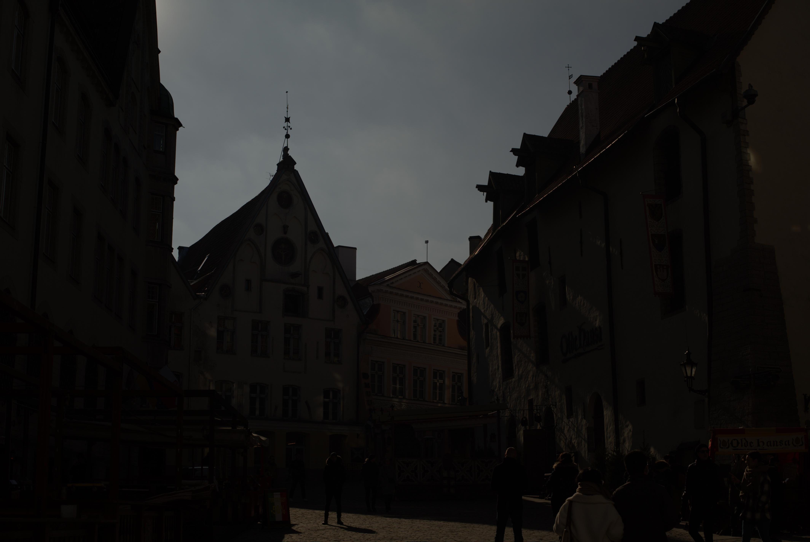
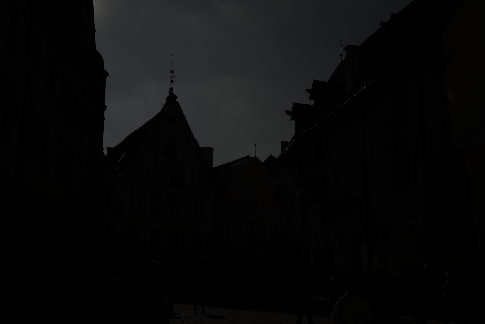

## Лабораторная работа 1. Получение изображений. Работа с RAW изображениями. Дебайеризация. Библиотеки работы с изображениями

План работ:
1. Подготовка среды программирования 
1. Поиск библиотек для работы с изображениями (OpenCV, Scikit-Image, Scipy, Python Image Library (Pillow/PIL), Matplotlib, SimpleITK, Numpy, Mahotas, Сolour)
1. Чтение изображений с камеры устройства
```
import cv2

cap = cv2.VideoCapture(0)
if not cap.isOpened():
	raise IOError("Cannot open webcam")
ret, frame = cap.read()
frame = cv2.resize(frame, None, 3, 3, cv2.INTER_AREA)
cv2.imwrite("camera.jpg", frame)
cap.release()
cv2.destroyAllWindows()

```


4. Создание алгоритма "байеризации"

```
import rawpy
import numpy as np
from PIL import Image
import imageio
import exifread

def pack_raw(raw_path):
    raw = rawpy.imread(raw_path)
    im = raw.raw_image_visible.astype(np.float32)
    im = np.maximum(im - raw.black_level_per_channel[0], 0) / (16383 - raw.black_level_per_channel[0])
    im = np.expand_dims(im, axis=2)
    
    H = im.shape[0]
    W = im.shape[1]
    # RGGB
    if raw.raw_pattern[0, 0] == 0:  
        out = np.concatenate((im[0:H:2, 0:W:2, :],
                              im[0:H:2, 1:W:2, :],
                              im[1:H:2, 1:W:2, :],
                              im[1:H:2, 0:W:2, :]), axis=2)
    # BGGR 
    elif raw.raw_pattern[0, 0] == 2:  
        out = np.concatenate((im[1:H:2, 1:W:2, :],
                              im[0:H:2, 1:W:2, :],
                              im[0:H:2, 0:W:2, :],
                              im[1:H:2, 0:W:2, :]), axis=2)
    # GRBG                          
    elif raw.raw_pattern[0, 0] == 1 and raw.raw_pattern[0, 1] == 0: 
        out = np.concatenate((im[0:H:2, 1:W:2, :],
                              im[0:H:2, 0:W:2, :],
                              im[1:H:2, 0:W:2, :],
                              im[1:H:2, 1:W:2, :]), axis=2)
    # GBRG
    elif raw.raw_pattern[0, 0] == 1 and raw.raw_pattern[0, 1] == 2: 
        out = np.concatenate((im[1:H:2, 0:W:2, :],
                              im[0:H:2, 0:W:2, :],
                              im[0:H:2, 1:W:2, :],
                              im[1:H:2, 1:W:2, :]), axis=2)
 
    wb = np.array(raw.camera_whitebalance, np.float32)
    wb[3] = wb[1]
    wb = wb / wb[1]
    out = np.minimum(out * wb, 1.0)
    out = adjust_out_matrix(raw_path, out)
    
    out0 = out[:, :, 0:1]
    out1 = out[:, :, 1:2]
    out2 = out[:, :, 2:3]
    out3 = out[:, :, 3:4]
    out_JPEG = np.concatenate((out0, (out1 + out3) / 2., out2), axis=2)      
    Image.fromarray(np.uint8(out_JPEG * 255)).save('res.jpg')
    return out
    
def adjust_out_matrix(RAW_path, out=None):
    raw = open(RAW_path, 'rb')
    exif_info = exifread.process_file(raw, details=False, strict=True)
    orientation_str = 'EXIF Orientation'
    if exif_info.__contains__('Image Orientation'):
        orientation_str = 'Image Orientation'
    orientation_info = exif_info[orientation_str].printable
    if orientation_info == 'Rotated 180':
        if out is None:
            return True
        else:
            if out.shape[2] == 3:
                out0 = out[:, :, :1]
                out1 = out[:, :, 1:2]
                out2 = out[:, :, 2:3]
                out = np.concatenate((out2, out1, out0), 2)
            elif out.shape[2] == 4:
                out0 = out[:, :, :1]
                out1 = out[:, :, 1:2]
                out2 = out[:, :, 2:3]
                out3 = out[:, :, 3:4]
                out = np.concatenate((out3, out2, out1, out0), 2)
            else:
                raise
            return np.flip(out)

    elif orientation_info == 'Horizontal (normal)':
        if out is None:
            return False
        else:
            return out
    else:
        raise
def do_HDR(x, curve_ratio):
    gray_scale = np.expand_dims(gray_ps(x), axis=-1)
    gray_scale_new = np.power(gray_scale, curve_ratio)
    return np.minimum(x * gray_scale_new / gray_scale, 1.0)  
    
def gray_ps(rgb):
    return np.power(np.power(rgb[:, :, 0], 2.2) * 0.2967 + np.power(rgb[:, :, 1], 2.2) * 0.6281
                    + np.power(rgb[:, :, 2], 2.2) * 0.0741, 1 / 2.2) + 1e-7

if __name__ == '__main__':
    raw = rawpy.imread('photo.arw')
    img = raw.postprocess(use_camera_wb=True, half_size=False, no_auto_bright=True, output_bps=16)
    imageio.imsave('photonew.jpg', img)

```



5. Выбор изображения для работы
  C https://www.signatureedits.com/free-raw-photos/
  
6. Реализация суперпикселей. 
```
import cv2
import numpy as np
img = cv2.imread("sp.jpg")
region_size=18
ruler = 20.0
slic = cv2.ximgproc.createSuperpixelSLIC(img,region_size,ruler)
slic.iterate(10) 
mask_slic = slic.getLabelContourMask() 
label_slic = slic.getLabels() 
number_slic = slic.getNumberOfSuperpixels() 
mask_inv_slic = cv2.bitwise_not(mask_slic)
img_slic = cv2.bitwise_and(img,img,mask_inv_slic) 
cv2.imshow("img_slic",img_slic)
cv2.waitKey(0)
cv2.destroyAllWindows()
```

7. Реализация билинейной интерполяции.

```
def BLI(img,height,width):
    scrH,scrW,_=img.shape
    img=np.pad(img,((0,1),(0,1),(0,0)),'constant')
    retimg=np.zeros((height,width,3),np.uint8)
    for i in range(height):
        for j in range(width):
            scrx=(i+1)*(scrH/height)-1
            scry=(j+1)*(scrW/width)-1
	    
            x=math.floor(scrx)
            y=math.floor(scry)
	    
            u=scrx-x
            v=scry-y
            retimg[i,j]=(1-u)*(1-v)*img[x,y]+u*(1-v)*img[x+1,y]+(1-u)*v*img[x,y+1]+u*v*img[x+1,y+1]
    return retimg
```


8. Реализация алгоритма VNG.
```
import cv2
import matplotlib.pyplot as plt
bayer = cv2.imread(r'vng.tif', -1)
fig = plt.figure(figsize=(8,8))
plt.imshow(bayer, cmap='gray')
plt.title('Input Image')
plt.show()
```


