# Лабораторная работа 2. Переход между цветовыми пространствами. Линейный и нелинейный переход. Мера цветовой разницы. Функции преобразования яркости. Гамма, логарифмическое, экспоненциаяльное кодирование.
План работ:

1. Скачать любое цифровое изображение. Желательно многоцветное
    Исходное изображение:
    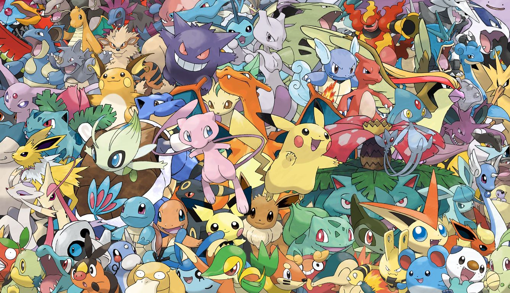
1. Отобразить изображение по каналам RGB (каждый канал представить как градации серого).
```
public void channelsGray(BufferedImage picture) throws IOException {
        int height = picture.getHeight();
        int width = picture.getWidth();
        BufferedImage biRed = new BufferedImage(width, height, TYPE_INT_RGB);
        BufferedImage biGreen = new BufferedImage(width, height, TYPE_INT_RGB);
        BufferedImage biBlue = new BufferedImage(width, height, TYPE_INT_RGB);
        for (int h = 0; h < height; h++) {
            for (int w = 0; w < width; w++) {
                int rgb = picture.getRGB(w, h);
                biRed.setRGB(w, h, rgb(red(rgb), red(rgb), red(rgb)));
                biGreen.setRGB(w, h, rgb(green(rgb),  green(rgb),  green(rgb)));
                biBlue.setRGB(w, h, rgb(blue(rgb), blue(rgb), blue(rgb)));
            }
        }
        save(biRed, "result/channelsGray", "red", FORMAT);
        save(biGreen, "result/channelsGray", "green", FORMAT);
        save(biBlue, "result/channelsGray", "blue", FORMAT);
    }
```
Результат: 

Red | Green | Blue
------ | ------|----------
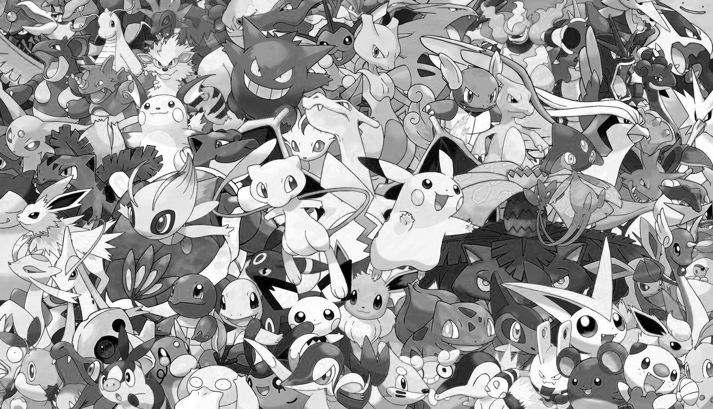      |  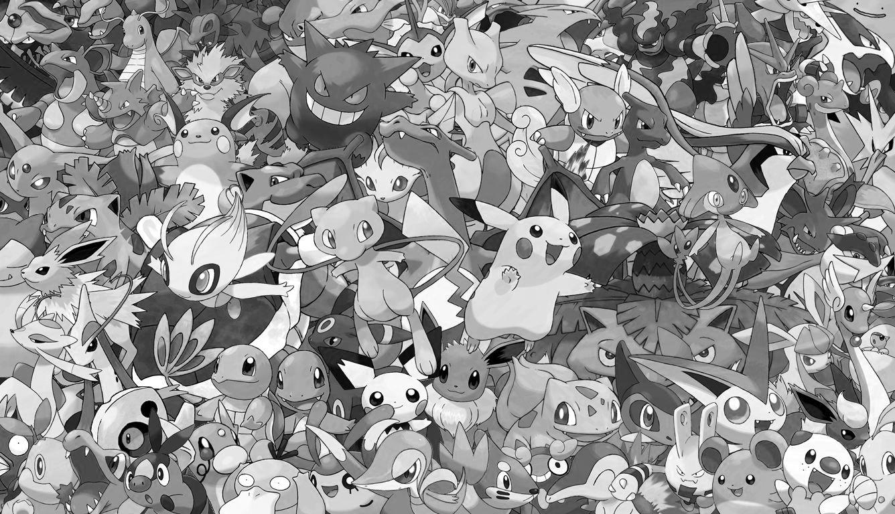    |  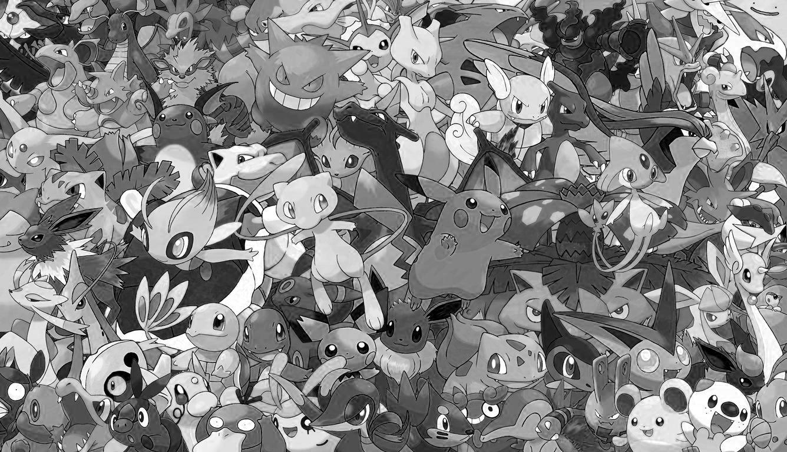


1. Лианеризовать изображение обратным гамма преобразованием.

```
    public BufferedImage retgamma(BufferedImage img, double gamma) throws IOException {
        int height = img.getHeight();
        int width = img.getWidth();
        BufferedImage bi = new BufferedImage(width, height, TYPE_INT_RGB);
        int[] colorCh = new int[256];
        for (int i = 0; i < colorCh.length; i++) {
            colorCh[i] = (int) (255 * (Math.pow(i / 255f, 1 / gamma)));
        }
        for (int h = 0; h < height; h++) {
            for (int w = 0; w < width; w++) {
                int rgb = img.getRGB(w, h);
                bi.setRGB(w, h, rgb(colorCh[red(rgb)], colorCh[green(rgb)], colorCh[blue(rgb)]));
            }
        }
        save(bi, "result/gammaCorrection", "result", FORMAT);
        return bi;
    }
}
```
 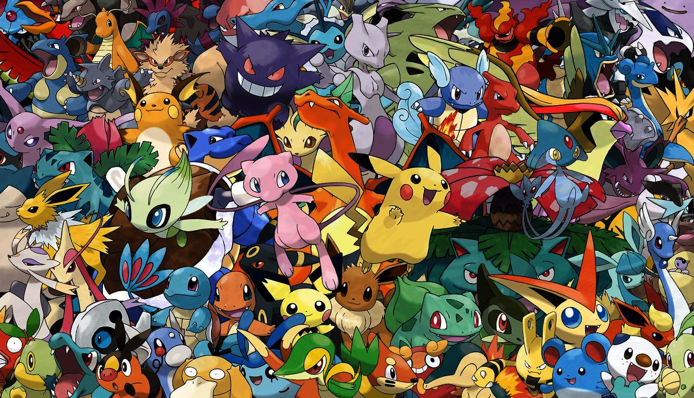

1. Отобразить по каналам RGB.
```
  public void rgbChannels(BufferedImage picture) throws IOException {
        int height = picture.getHeight();
        int width = picture.getWidth();
        BufferedImage biRed = new BufferedImage(width, height, TYPE_INT_RGB);
        BufferedImage biGreen = new BufferedImage(width, height, TYPE_INT_RGB);
        BufferedImage biBlue = new BufferedImage(width, height, TYPE_INT_RGB);
        for (int x = 0; x < height; x++) {
            for (int y = 0; y < width; y++) {
                int rgb = picture.getRGB(y, x);
                biRed.setRGB(y, x, rgb(red(rgb), 0, 0));
                biGreen.setRGB(y, x, rgb(0, green(rgb), 0));
                biBlue.setRGB(y, x, rgb(0, 0, blue(rgb)));
            }
        }
        save(biRed, "result/rgbChannels", "red", FORMAT);
        save(biGreen, "result/rgbChannels", "green", FORMAT);
        save(biBlue, "result/rgbChannels", "blue", FORMAT);
    }
```

Red | Green | Blue
------ | ------|----------
 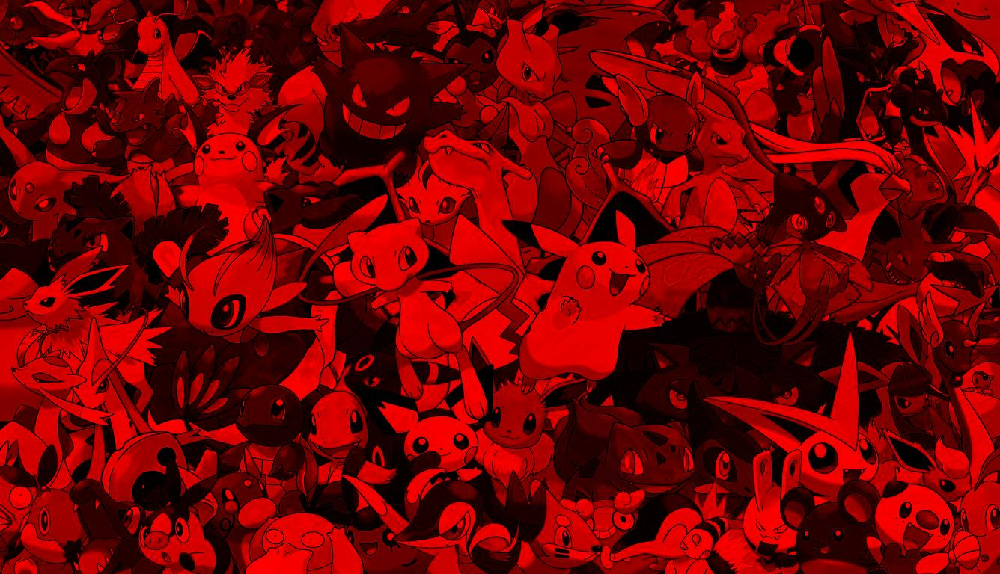      |   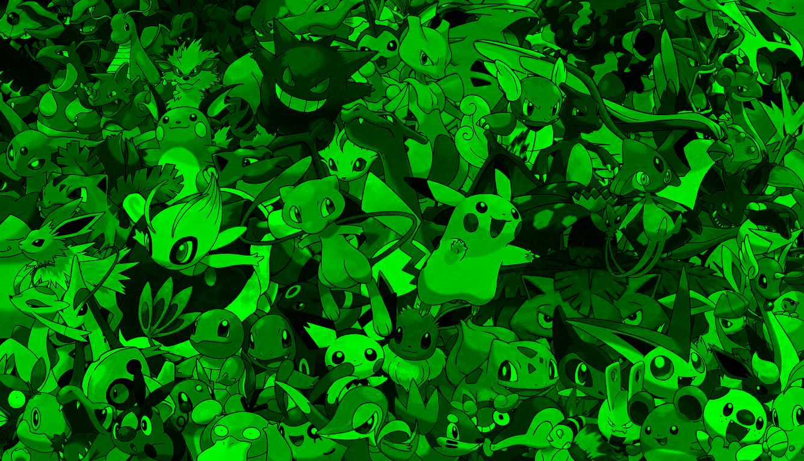   |   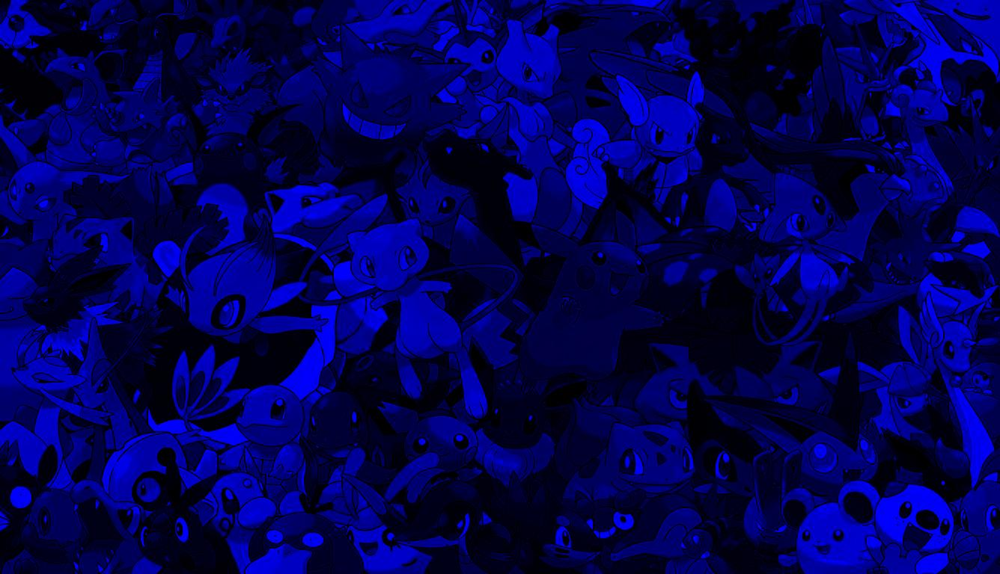
 
1. Отобразить поканально разницу между исходным изображением и линеаризованным.

Red | Green | Blue
------ | ------|----------
 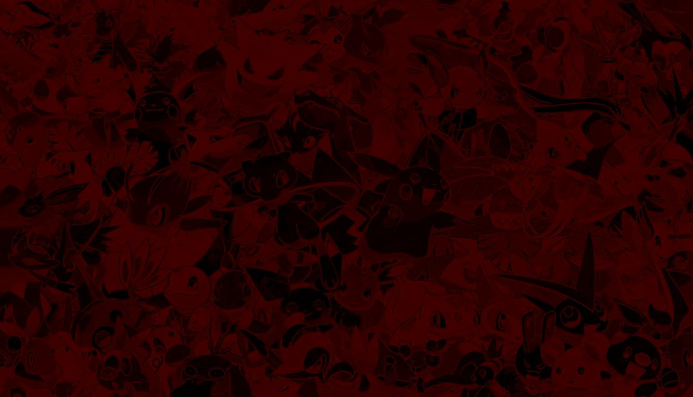      |   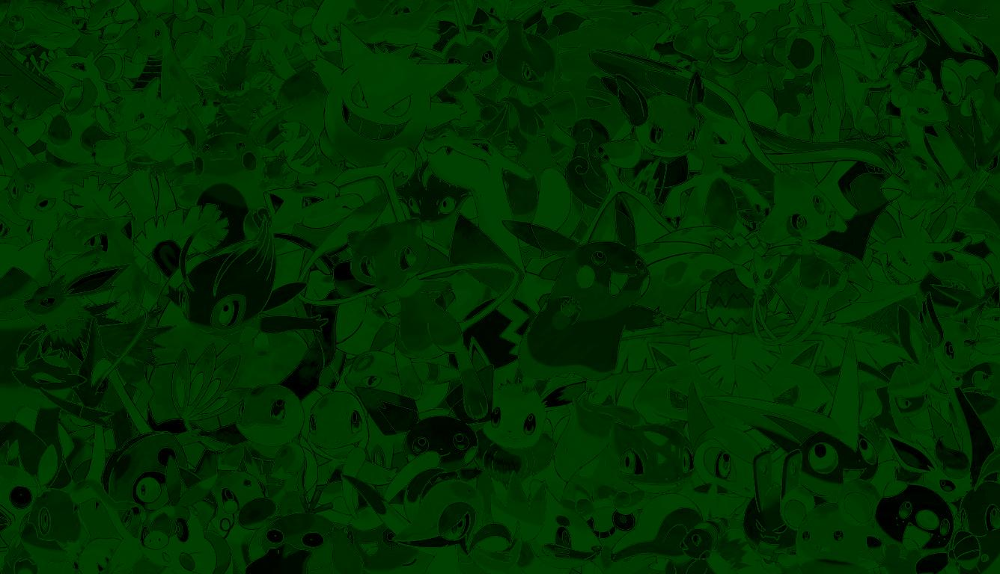   |   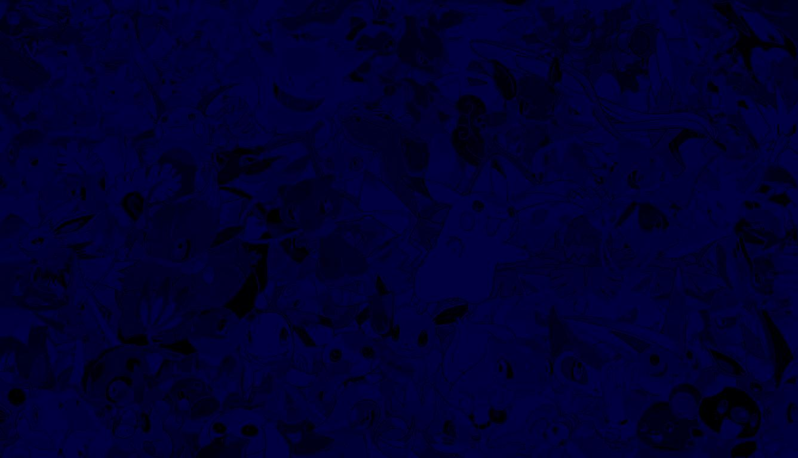


1. Написать функцию перевода цветов из линейного RGB в XYZ с использованием матрицы. Найти подходящую библиотечную функцию. Сравнить результаты через построение разностного изоборажения.

```
  public BufferedImage RGBtoXYZ(BufferedImage picture) throws IOException {
        Mat xyzOpenCV = new Mat();
        Imgproc.cvtColor(img2Mat(picture), xyzOpenCV, Imgproc.COLOR_BGR2XYZ);
        BufferedImage resultLib = (BufferedImage) HighGui.toBufferedImage(xyzOpenCV);
        int height = picture.getHeight();
        int width = picture.getWidth();
        BufferedImage custom = new BufferedImage(width, height, TYPE_INT_RGB);
        for (int i = 0; i < height; i++) {
            for (int j = 0; j < width; j++) {
                int rgb = picture.getRGB(j, i);
                int[] xyz = RGBtoXYZ(ch1(rgb), ch2(rgb), ch3(rgb));
                custom.setRGB(j, i, color(xyz[2], xyz[1], xyz[0]));
            }
        }
        save(custom, "result/RGBtoXYZ", "custom", FORMAT);
        save(resultLib, "result/RGBtoXYZ", "lib", FORMAT);
        save(difference(custom, resultLib), "result/RGBtoXYZ", "difference", FORMAT);
        return custom;
    }

    private static int[] RGBtoXYZ(double r, double g, double b) {
        return new int[]{
                (int) Math.round(r * 0.412453 + g * 0.357580 + b * 0.180423),
                (int) Math.round(r * 0.212671 + g * 0.715160 + b * 0.072169),
                (int) Math.round(r * 0.019334 + g * 0.119193 + b * 0.950227)
        };
    }
```
Custom | OpenCV | difference
------ | ------|----------
     |  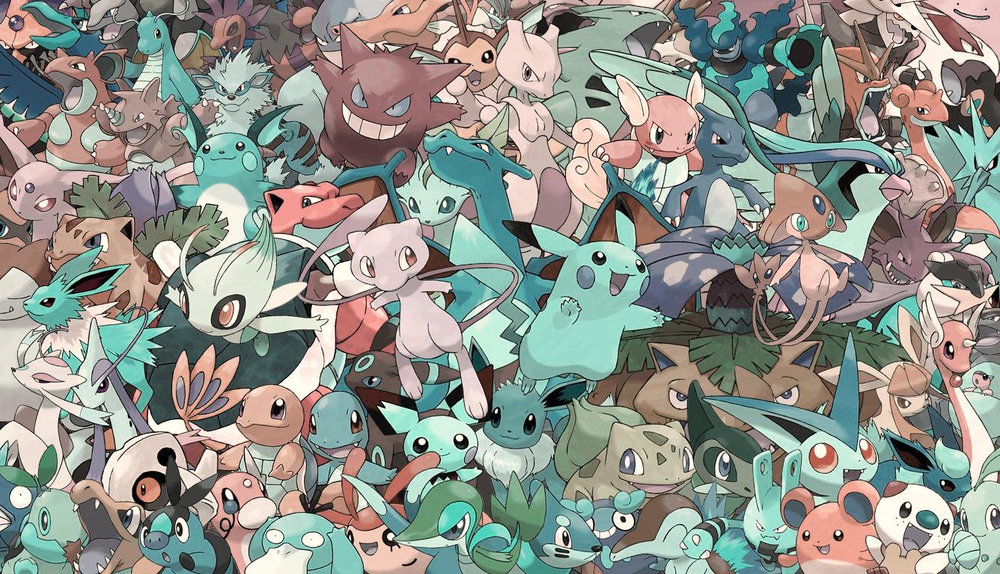  |   

3. Написать функцию перевода цветов из XYZ в RGB (построить обратную матрицу XYZ в RGB). Преобразовать изображение XYZ в линейный RGB. Применить гамма преобразование. Сравнить результаты через построение разностного изоборажения.
```
    public BufferedImage XYZtoRGB(BufferedImage picture) throws IOException {
        Mat rgbOpenCV = new Mat();
        Imgproc.cvtColor(img2Mat(picture), rgbOpenCV, Imgproc.COLOR_XYZ2BGR);
        BufferedImage resultLib = (BufferedImage) HighGui.toBufferedImage(rgbOpenCV);
        int height = picture.getHeight();
        int width = picture.getWidth();
        BufferedImage custom = new BufferedImage(width, height, TYPE_INT_RGB);
        for (int i = 0; i < height; i++) {
            for (int j = 0; j < width; j++) {
                int xyz = picture.getRGB(j, i);
                int[] rgb = XYZtoRGB(ch3(xyz), ch2(xyz), ch1(xyz));
                custom.setRGB(j, i, color(rgb[2],rgb[1],rgb[0]));
            }
        }
        save(custom, "result/XYZtoRGB", "custom", FORMAT);
        save(resultLib, "result/XYZtoRGB", "lib", FORMAT);
        save(difference(custom, resultLib), "result/XYZtoRGB", "difference", FORMAT);
        return custom;
    }

    private static int[] XYZtoRGB(int x, int y, int z) {
        return new int[]{
                (int) Math.round(x * 3.240479 + y * -1.537150 + z * -0.498535),
                (int) Math.round(x * -0.969256 + y * 1.875991 + z * 0.041556),
                (int) Math.round(x * 0.055648 + y * -0.204043 + z * 1.057311)
        };
    }
```

Custom | OpenCV | difference
------ | ------|----------
     |  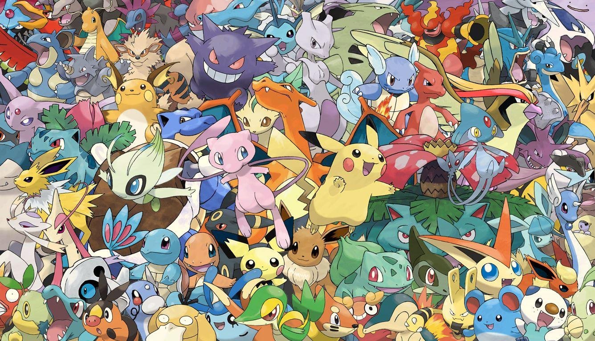  |   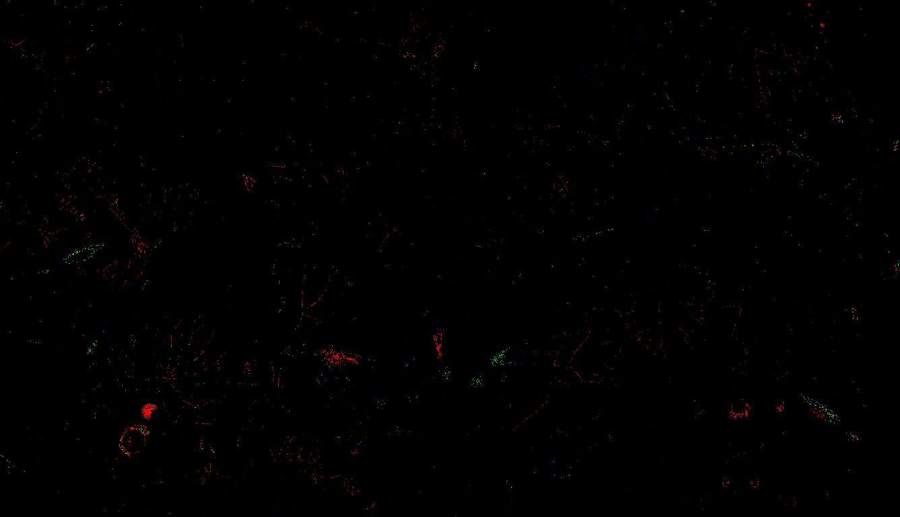

5. Построить проекцию цветов исходного изображения на цветовой локус (плоскость xy).
```
public void colorLocus(BufferedImage picture) throws IOException {
        int size = 1000;
        int xMove = (int) Math.round(0.312 * size) / 2;
        int yMove = (int) Math.round(0.329 * size) / 2;
        BufferedImage locus = new BufferedImage(size, size, TYPE_INT_RGB);
        for (int i = 0; i < picture.getHeight(); i++) {
            for (int j = 0; j < picture.getWidth(); j++) {
                int rgb = picture.getRGB(j, i);
                int[] xyz = RGBtoXYZ(ch1(rgb), ch2(rgb), ch3(rgb));
                double sum = xyz[0] + xyz[1] + xyz[2];
                if (sum > 0) {
                    double avgX = xyz[0] / sum;
                    double avgY = xyz[1] / sum;
                    double avgZ = xyz[2] / sum;
                    int x = (int) Math.round((1 - avgY - avgZ) * size) + xMove;
                    int y = (int) Math.round((1 - avgX - avgZ) * size * -1) + size - yMove;
                    try {
                        locus.setRGB(x, y, rgb);
                    } catch (Exception e) { }
                }
            }
        }
        save(locus, "result/locus", "result", FORMAT);
    }
```
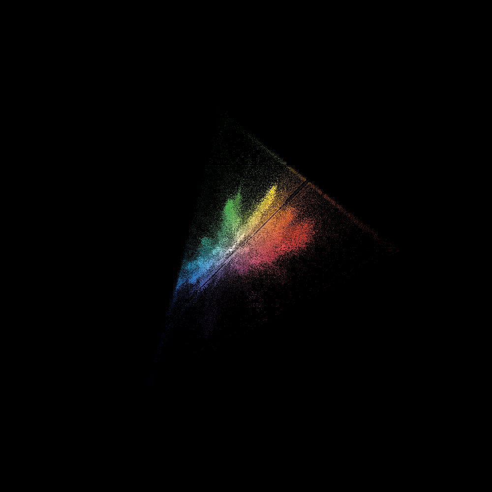

7. Написать функцию перевода цветов из линейного RGB в HSV и обратно. Найти подходящую библиотечную функцию. Сравнить результаты через построение разностного изоборажения.

```
  public BufferedImage RGBtoHSV(BufferedImage picture) throws IOException {
        Mat hsvOpenCV = new Mat();
        Imgproc.cvtColor(img2Mat(picture), hsvOpenCV, Imgproc.COLOR_BGR2HSV);
        BufferedImage resultLib = (BufferedImage) HighGui.toBufferedImage(hsvOpenCV);
        int height = picture.getHeight();
        int width = picture.getWidth();
        BufferedImage custom = new BufferedImage(width, height, TYPE_INT_RGB);
        for (int i = 0; i < height; i++) {
            for (int j = 0; j < width; j++) {
                int color = picture.getRGB(j, i);
                double[] hsv = RGBtoHSV(ch1(color), ch2(color), ch3(color));
                custom.setRGB(j, i, color(hsv[2], hsv[1], hsv[0]));
            }
        }
        save(custom, "result/RGBtoHSV", "custom", FORMAT);
        save(resultLib, "result/RGBtoHSV", "lib", FORMAT);
        save(difference(custom, resultLib), "result/RGBtoHSV", "difference", FORMAT);
        return custom;
    }

    private static double[] RGBtoHSV(int r, int g, int b) {
        List<Integer> arr = Arrays.asList(r, g, b);
        double min = Collections.min(arr);
        double v = Collections.max(arr);
        double s;
        if (v == 0) {
            s = 0;
        } else {
            s = 1 - min / v;
        }
        double h = 0;
        if (v == r) {
            h = 60 * (g - b) / (v - min);
        } else if (v == g) {
            h = 60 * (b - r) / (v - min) + 120;
        } else if (v == b) {
            h = 60 * (r - g) / (v - min) + 240;
        }
        if (h < 0) h += 360;
        return new double[]{h / 2, s * 255, v * 255};
    }
```
Custom | OpenCV | difference
------ | ------|----------
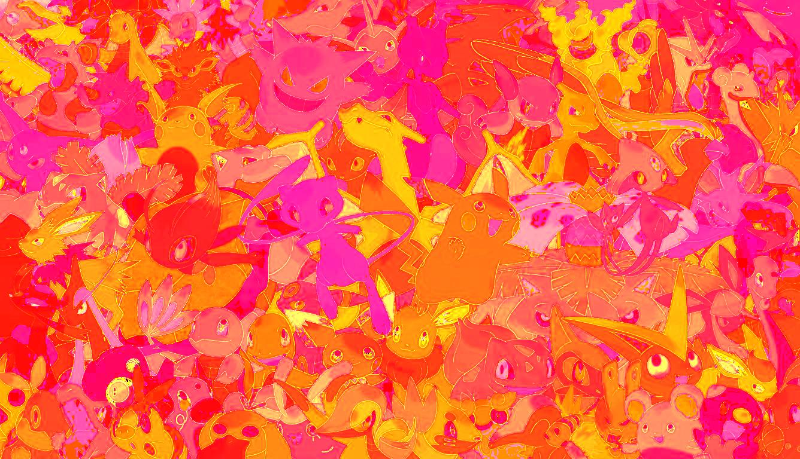     |  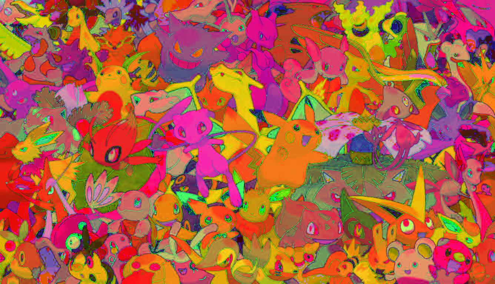  |   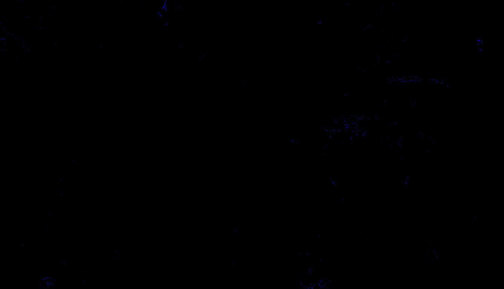

```
    public BufferedImage HSVtoRGB(BufferedImage picture) throws IOException {
        Mat rgbOpenCV = new Mat();
        Imgproc.cvtColor(img2Mat(picture), rgbOpenCV, Imgproc.COLOR_HSV2BGR);
        BufferedImage resultLib = (BufferedImage) HighGui.toBufferedImage(rgbOpenCV);
        int height = picture.getHeight();
        int width = picture.getWidth();
        BufferedImage custom = new BufferedImage(width, height, TYPE_INT_RGB);
        for (int i = 0; i < height; i++) {
            for (int j = 0; j < width; j++) {
                int color = picture.getRGB(j, i);
                int rgb = HSVtoRGB(ch3(color), ch2(color), ch1(color));
                custom.setRGB(j, i, rgb);
            }
        }
        save(custom, "result/HSVtoRGB", "custom", FORMAT);
        save(resultLib, "result/HSVtoRGB", "lib", FORMAT);
        save(difference(custom, resultLib), "result/HSVtoRGB", "difference", FORMAT);
        return custom;
    }

    public static int HSVtoRGB(float hue, float saturation, float value) {
        float R, G, B;
        hue = hue/180f;
        saturation = saturation/255f;
        value = value/255f;
        if (saturation == 0) {
            R = value * 255;
            G = value * 255;
            B = value * 255;
        } else
            {
            float var_h = hue * 6;
            if (var_h == 6) {
                var_h = 0;
            }
            int var_i = (int) Math.floor(var_h);
            float p = value * (1 - saturation);
            float q = value * (1 - saturation * (var_h - var_i));
            float t = value * (1 - saturation * (1 - (var_h - var_i)));
            float var_r;
            float var_g;
            float var_b;
            if (var_i == 0) {
                var_r = value;
                var_g = t;
                var_b = p;
            } else if (var_i == 1) {
                var_r = q;
                var_g = value;
                var_b = p;
            } else if (var_i == 2) {
                var_r = p;
                var_g = value;
                var_b = t;
            } else if (var_i == 3) {
                var_r = p;
                var_g = q;
                var_b = value;
            } else if (var_i == 4) {
                var_r = t;
                var_g = p;
                var_b = value;
            } else {
                var_r = value;
                var_g = p;
                var_b = q;
            }
            R = var_r * 255;
            G = var_g * 255;
            B = var_b * 255;
        }
        return color(R, G, B);
    }
```
Custom | OpenCV | difference
------ | ------|----------
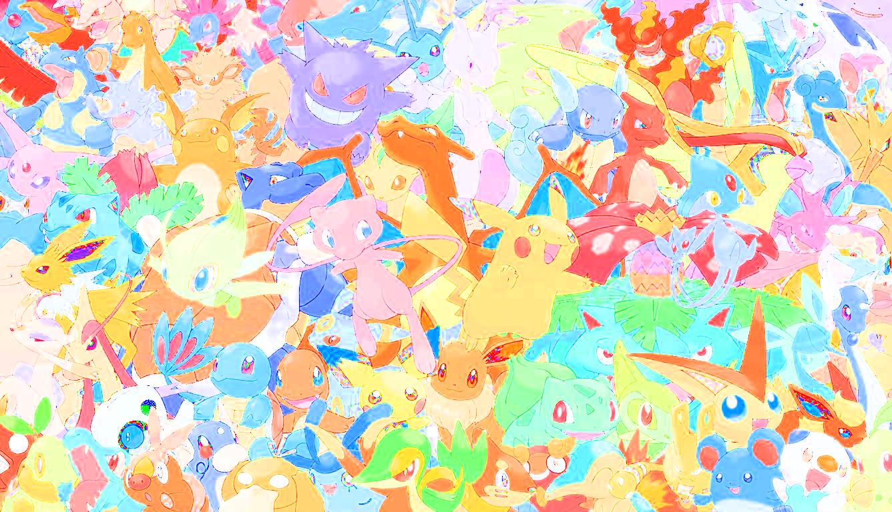     |    |   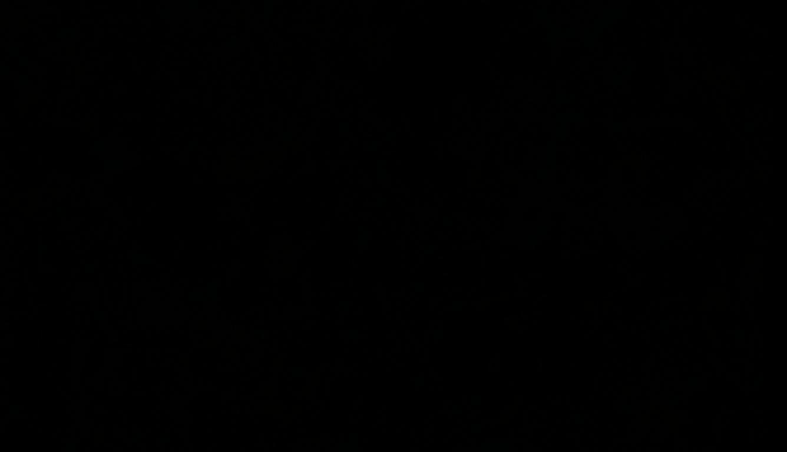

