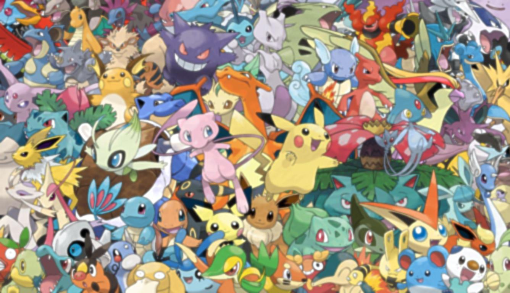
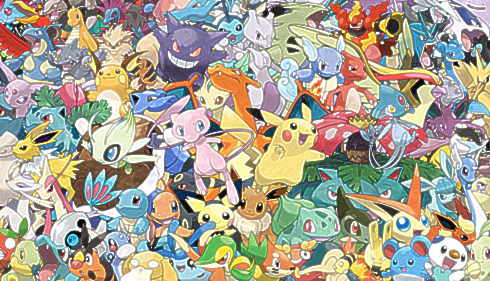
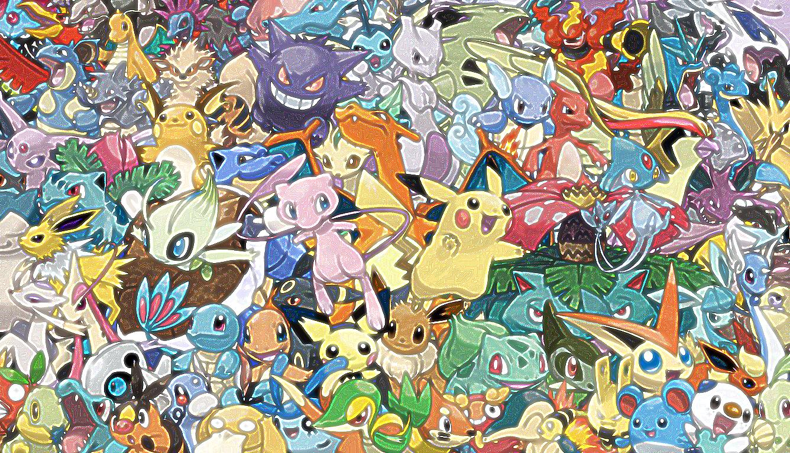

## Лабораторная работа 4. Повышение резкости изображений.

План работ:
1. Скачать любое цифровое изображение. Желательно многоцветное

    Исходное изображение:
    


2. Применить к исходному изображению Гауссово размытие. Отобразить результат.

[GaussBlur](resources/GaussBlur.java)

  


4. Реализовать функцию повышения резкости методом усиления границ.
5. Применить построенную функцию к размытому изображению. Вывести результат работы функции вместе с исходным изображением.
  Данная функция применяет Гауссово размытие повторно и вычитает результат из оригинального изображения. Таким образом получается "маска" с усиленными границами, которая прибавляется к исходному изображение. 
  
```
  public BufferedImage sharp(BufferedImage img, int repeat) throws IOException {
      BufferedImage result = new BufferedImage(img.getWidth(), img.getHeight(), TYPE_INT_RGB);
      GaussianBlur blur = new GaussianBlur();
      for (int i = 0; i < repeat; i++) {
          result = sum(img, diff(img, blur.process(img)));
          img.setData(result.getData());
          save(result, "result/sharp", "result" + i, FORMAT);
      }
      return result;
  }
      
                                 
```

Step0 | Step1 | Step2 | Step3 | Step4
------ | ------|----------| ------|----------
    |     |   |  | 
                                
6. Используя две любые функции повышающие резкость изображения, обработать размытое изображение. Результаты также вывести вместе с исходным изображением для сравнения.
  * Первая функция 
  
   Здесь используется размытие по Гауссу, но вычитание размытой версии из исходного изображения происходит взвешенным образом.
  
```
    private void weighted(BufferedImage img) throws IOException {
        Mat blurred = new Mat();
        Imgproc.GaussianBlur(img2Mat(img), blurred, new Size(0, 0), 3);
        Mat weighted = blurred.clone();
        Core.addWeighted(blurred, 1.5, weighted, -0.5, 0, weighted);
        BufferedImage result = (BufferedImage) HighGui.toBufferedImage(weighted);
        save(result, "result/weighted", "result", FORMAT);
    }
  
```
  

  
  * Вторая функция 
  
  В этом способе повышения резкости ипользуется функция 2D-фильтрации и сверточная матрица, часто называемая ядром. 

```
  
    private void kernel(BufferedImage img) throws IOException {
        Mat kernel = new Mat(3, 3, CvType.CV_16SC1);
        kernel.put(0, 0, 0, -1, 0, -1, 5, -1, 0, -1, 0);
        Mat sharped = new Mat();
        Imgproc.filter2D(img2Mat(img), sharped, -1, kernel);
        BufferedImage result = (BufferedImage) HighGui.toBufferedImage(sharped);
        save(result, "result/kernel", "result", FORMAT);
    }
  
```
  

