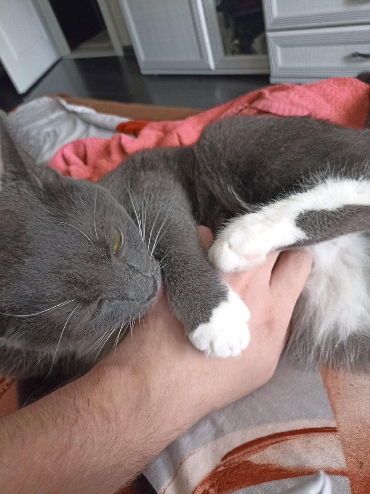
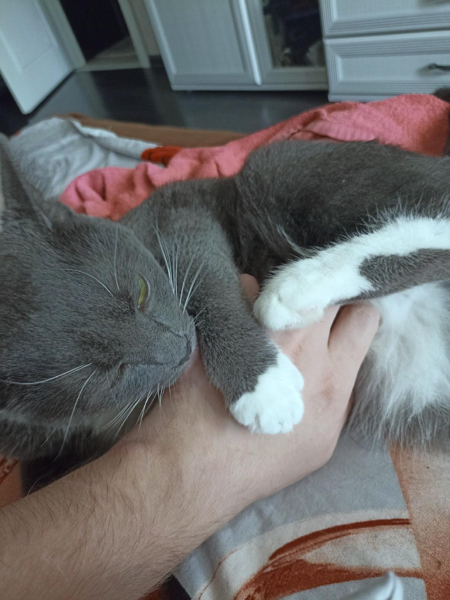
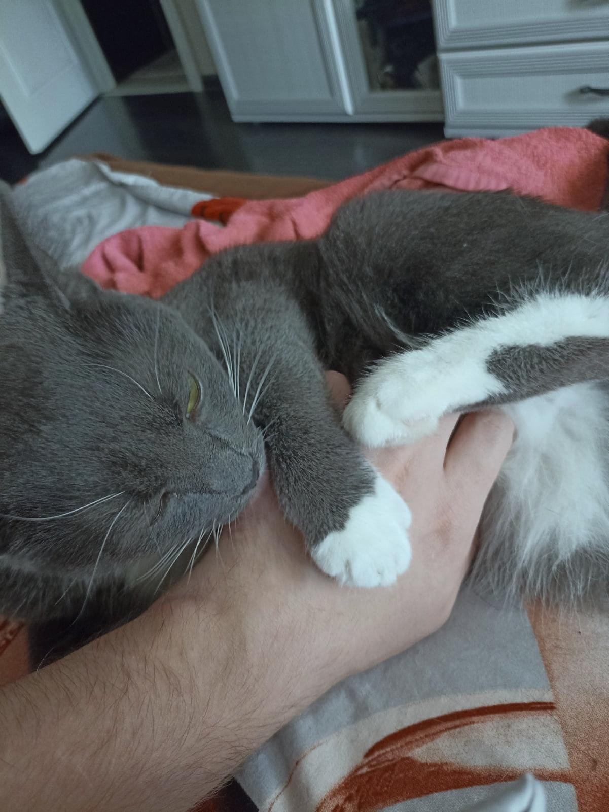

## Лабораторная работа 5. Баланс белого

План работ:
### Скачать цветное изображение по выбору с нарушенным цветовым балансом (желательно, чтобы на изображении был объект предположительно белого цвета).


### Определить вручную цвет объекта, построить преобразование (матрицу 3х3) для коррекции белого.
 Применить к изображению.

```
private void whiteCorrect(BufferedImage picture) throws IOException {
        int height = picture.getHeight();
        int width = picture.getWidth();
        BufferedImage result = new BufferedImage(width, height, TYPE_INT_RGB);
        float[][] matr = {
                {255/233f, 0, 0},
                {0, 255/238f, 0},
                {0, 0, 255/231f}
        };
        for (int i = 0; i < height; i++) {
            for (int j = 0; j < width; j++) {
                int color = picture.getRGB(j, i);
                int r = ch1(color);
                int g = ch2(color);
                int b = ch3(color);
                int balancedColor = color(
                        Math.round(r * matr[0][0] + g * matr[0][1] + b * matr[0][2]),
                        Math.round(r * matr[1][0] + g * matr[1][1] + b * matr[1][2]),
                        Math.round(r * matr[2][0] + g * matr[2][1] + b * matr[2][2])
                );
                result.setRGB(j, i, balancedColor);
            }
        }
        save(result, "result/whiteBalance", "whiteBalance", FORMAT);
    }
```



### Исходное изображение скорректировать согласно теории Серого мира вручную.

```
    private void grayWorld(BufferedImage picture) throws IOException {
        int height = picture.getHeight();
        int width = picture.getWidth();
        float avgRed = 0;
        float avgGreen = 0;
        float avgBlue = 0;
        for (int i = 0; i < height; i++) {
            for (int j = 0; j < width; j++) {
                int color = picture.getRGB(j, i);
                avgRed = avgRed +ch1(color);
                avgGreen = avgGreen + ch2(color);
                avgBlue = avgBlue + ch3(color);
            }
        }
        float pictureSize = height*width;
        avgRed = avgRed/pictureSize;
        avgGreen = avgGreen/pictureSize;
        avgBlue = avgBlue/pictureSize;
        float avgGray = (avgRed+avgGreen+avgBlue)/3f;
        float coefR = avgGray/avgRed;
        float coefG = avgGray/avgGreen;
        float coefB = avgGray/avgBlue;
        BufferedImage result = new BufferedImage(width, height, TYPE_INT_RGB);
        for (int i = 0; i < height; i++) {
            for (int j = 0; j < width; j++) {
                int color = picture.getRGB(j, i);
                int r = Math.round(ch1(color)*coefR);
                if (r<0)
                    r=0;
                int g = Math.round(ch2(color)*coefG);
                if (g<0)
                    g=0;
                int b = Math.round(ch3(color)*coefB);
                if (b<0)
                    b=0;
                result.setRGB(j, i, color(r, g, b));
            }
        }
        save(result, "result/grayWorld", "grayWorld", FORMAT);
    }
```



### Исходное изображение скорректировать согласно теории Серого мира при помощи библиотечной функции.

```
    private void grayWorldLib(BufferedImage picture) throws IOException {
        Mat matOpenCV = new Mat();
        GrayworldWB alg = Xphoto.createGrayworldWB();
        alg.balanceWhite(img2Mat(picture), matOpenCV);
        BufferedImage result = (BufferedImage) HighGui.toBufferedImage(matOpenCV);
        save(result, "result/grayWorldLib", "grayWorldLib", FORMAT);
    }
```



