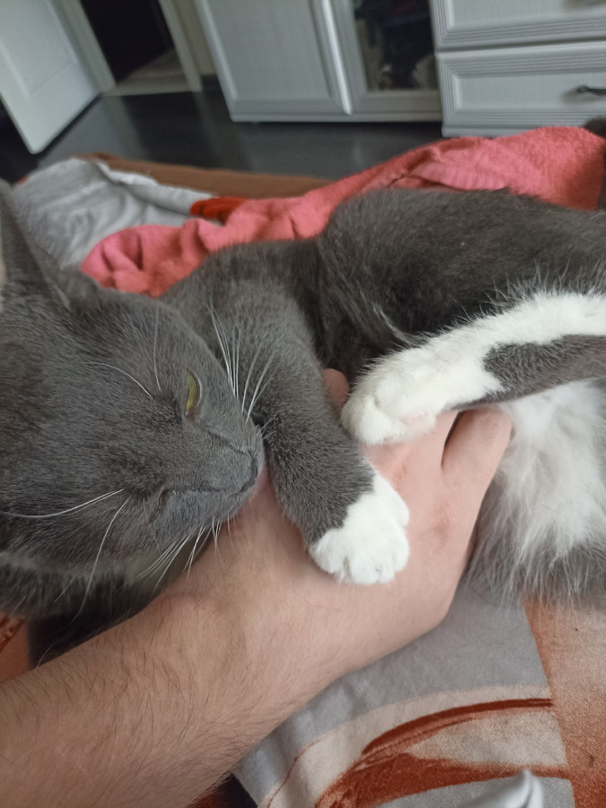
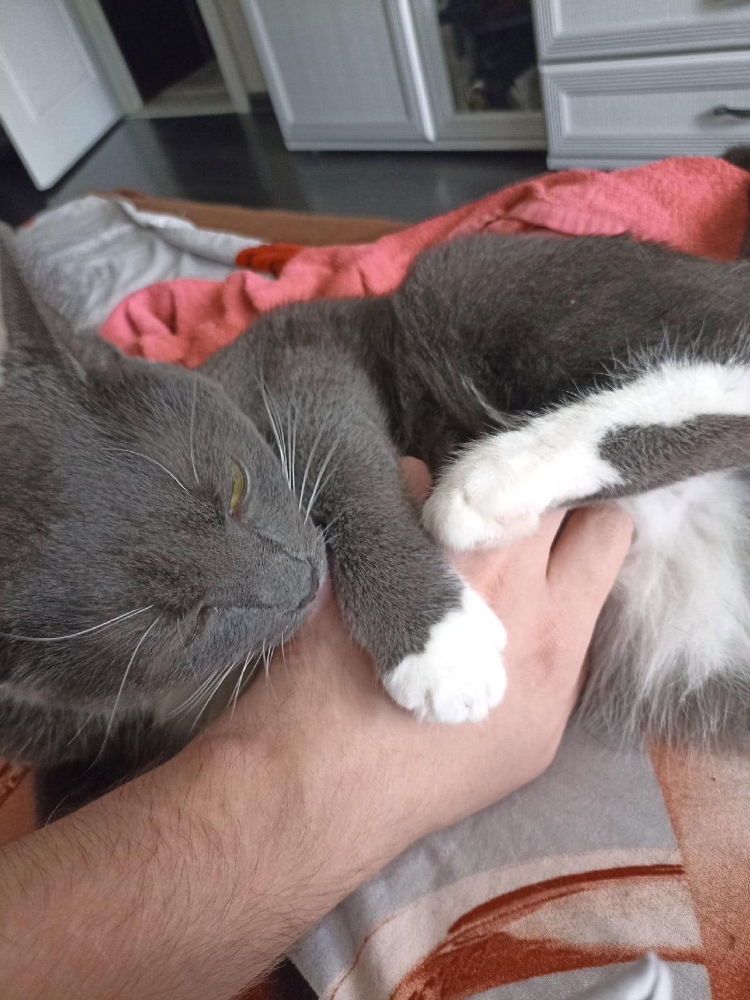
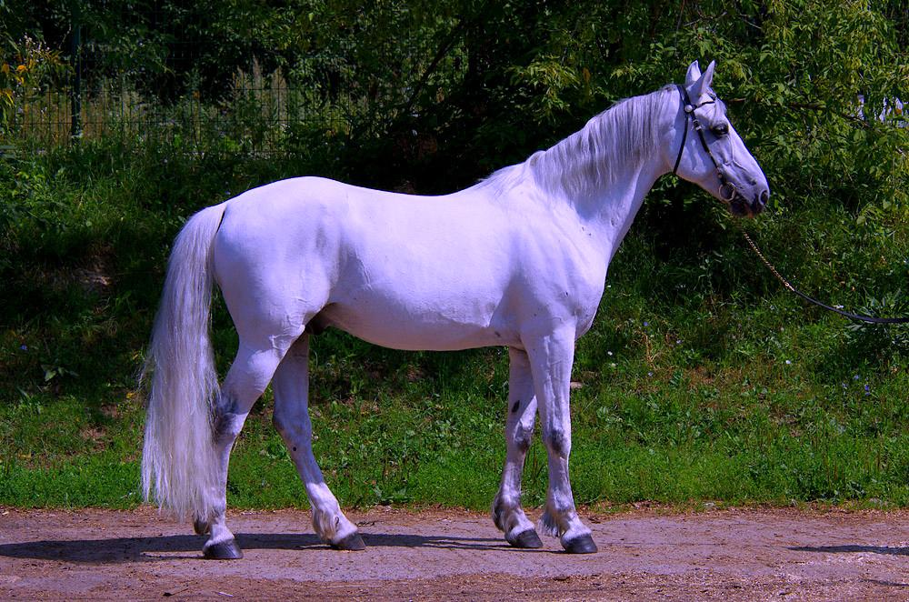
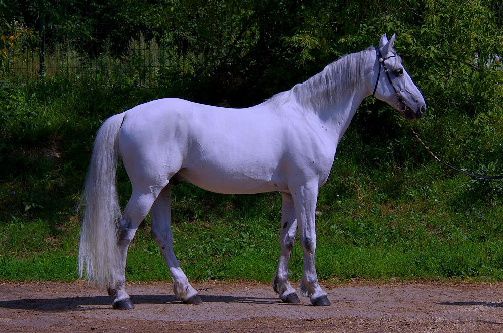

## Лабораторная работа 5. Баланс белого.

План работ:
1. Скачать цветное изображение по выбору с нарушенным цветовым балансом (желательно, чтобы на изображении был объект предположительно белого цвета).


2. Определить вручную цвет объекта, построить преобразование (матрицу 3х3) для коррекции белого.
 Применить к изображению. Не забудьте про нормировку яркости (если она будет нужна).

```
private void whiteBalance(BufferedImage img) throws IOException {
    float[][] m = {
            {255/222f, 0, 0},
            {0, 255/243f, 0},
            {0, 0, 255/255f}
    };
    int h = img.getHeight();
    int w = img.getWidth();
    BufferedImage result = new BufferedImage(w, h, TYPE_INT_RGB);
    for (int i = 0; i < h; i++) {
        for (int j = 0; j < w; j++) {
            int color = img.getRGB(j, i);
            int r = ch1(color);
            int g = ch2(color);
            int b = ch3(color);
            int balancedColor = color(
                    Math.round(r * m[0][0] + g * m[0][1] + b * m[0][2]),
                    Math.round(r * m[1][0] + g * m[1][1] + b * m[1][2]),
                    Math.round(r * m[2][0] + g * m[2][1] + b * m[2][2])
            );
            result.setRGB(j, i, balancedColor);
        }
    }
    save(result, "result", "whiteBalance", FORMAT);
}
```



3. Исходное изображение скорректировать согласно теории Серого мира вручную.

```
    private void grayWorld(BufferedImage img) throws IOException {
        int h = img.getHeight();
        int w = img.getWidth();
        float avgRed = 0;
        float avgGreen = 0;
        float avgBlue = 0;
        for (int i = 0; i < h; i++) {
            for (int j = 0; j < w; j++) {
                int color = img.getRGB(j, i);
                avgRed += ch1(color);
                avgGreen += ch2(color);
                avgBlue += ch3(color);
            }
        }
        float pixelCount = h*w;
        avgRed = avgRed/pixelCount;
        avgGreen = avgGreen/pixelCount;
        avgBlue = avgBlue/pixelCount;
        float avgGray = (avgRed+avgGreen+avgBlue)/3f;
        float kr = avgGray/avgRed;
        float kg = avgGray/avgGreen;
        float kb = avgGray/avgBlue;
        BufferedImage result = new BufferedImage(w, h, TYPE_INT_RGB);
        for (int i = 0; i < h; i++) {
            for (int j = 0; j < w; j++) {
                int color = img.getRGB(j, i);
                int r = Math.round(ch1(color)*kr);
                int g = Math.round(ch2(color)*kg);
                int b = Math.round(ch3(color)*kb);
                if (r<0) r=0;
                if (g<0) g=0;
                if (b<0) b=0;
                result.setRGB(j, i, color(r, g, b));
            }
        }
        save(result, "result", "grayWorld", FORMAT);
    }
```



4. Исходное изображение скорректировать согласно теории Серого мира при помощи библиотечной функции.

```
    private void grayWorldLib(BufferedImage img) throws IOException {
        Mat mat = new Mat();
        GrayworldWB alg = Xphoto.createGrayworldWB();
        alg.balanceWhite(img2Mat(img), mat);
        BufferedImage result = (BufferedImage) HighGui.toBufferedImage(mat);
        save(result, "result", "grayWorldLib", FORMAT);
    }
```



7. Все результаты вывести на экран рядом для визуального сравнения.
